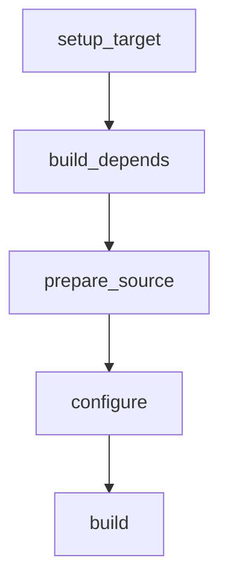

# Package Build Scripts

My package build scripts

Features:

- Build with NDK
- Statically linked binaries oriented.

Work flow



## Usage

### Run in command line

```sh
## Build for host machine
./build-packages.sh <packag1> <package2> ...

## Build for android
## Android ABIs:
##      aarch64-linux-android
##      armv7a-linux-androideabi
##      x86_64-linux-android
##      i686-linux-android
TARGET=aarch64-linux-android28 ./build-package.sh <package1> <packge2> ...

## Build for aarch64-linux-musl
TARGET=aarch64-linux-android28 ./build-package.sh <package1> <packge2> ...

```

### Functions defined in build.sh

```sh
## Parepare source and cd to source dir
## Overide this function to prepare source by your self
prepare_source() {
    # cd "${SRCS_DIR}"
    # git clone <URL> <pacakge_name>
    # cd <package_name>
}
```

```sh
## Step to configure
configure() {
    ## Custom API
    # export API=28
    #

    ## Autoconf
    # ./configure --host="${TARGET}" --prefix="${OUTPUT_DIR}"
}
```

```sh
## Step to build
build() {
    # make -j"${JOBS}" install

    ## Build a go package
    # setup_golang
    # go build -ldflags="-w -s -X main.Version=${PKG_VERSION}"
}
```

```sh
## Step to check
## If current package is a dependency to the other package declaimed by function 'depends',
## during building of the other package,
## functions prepare_depends will be called and then call this function to check if it is built.
check() {
    # test -f "${OUTPUT_DIR}/lib/<lib_xxx>.a"
}
```

We do not need to write all of the these functions above, for example: when building a go pacakge, writing the build function is just enough.
